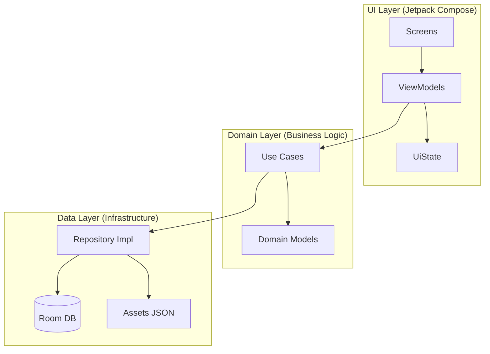

# Architettura del Sistema - DrugDose

Questo documento fornisce una spiegazione approfondita delle scelte architettoniche, dei design pattern e della filosofia di sviluppo adottata per il progetto **DrugDose**.

> [!NOTE]
> **Autore**: Thomas Riotto  
> **Contesto**: Progetto per il corso di Sviluppo Applicazioni Mobili - Università degli Studi dell'Insubria.

---

## 🏛️ Visione d'Insieme
L'applicazione è costruita seguendo i principi della **Clean Architecture** e del pattern **MVVM (Model-View-ViewModel)**. L'obiettivo primario è la separazione delle responsabilità per garantire testabilità, manutenibilità e robustezza (fondamentale in un contesto clinico).

### Diagramma dei Livelli

---

## 층 1: UI Layer (Presentation)
Il livello di presentazione è gestito tramite **Jetpack Compose**, il toolkit moderno di Google per UI dichiarative.

- **Unidirectional Data Flow (UDF)**: Lo stato fluisce verso il basso (dal ViewModel alla UI tramite `UiState`), mentre gli eventi fluiscono verso l'alto.
- **State Hoisting**: I componenti sono progettati per essere il più possibile "stateless", facilitando le anteprime (Compose Previews) e i test unitari della UI.
- **Material Design 3**: L'app implementa un tema personalizzato con colori accessibili (WCAG AAA) e componenti coerenti col settore medico.

---

## 층 2: Domain Layer (Business Logic)
È il cuore dell'applicazione, scritto in puro Kotlin e privo di dipendenze da framework esterni.

- **Use Cases**: Ogni operazione (es. `CalculateDoseUseCase`) è isolata in una classe singola che implementa una specifica regola di business.
- **Safety First**: La logica di calcolo include un "Clinical Safety Layer" che valida l'età e il peso del paziente prima di procedere, lanciando eccezioni controllate in caso di rischi.

---

## 층 3: Data Layer (Data & Infrastructure)
Responsabile della persistenza e del recupero dei dati.

- **Room Database**: Utilizzato per la gestione dei farmaci. All'avvio, il database viene popolato tramite un file `drugs.json` contenuto negli assets.
- **Repository Pattern**: Astrae la sorgente dei dati (DB locale o JSON), fornendo al Domain Layer un'interfaccia pulita (`DrugRepository`).
- **Mappers**: Classi dedicate convertono le entità del database (`DrugEntity`) in modelli di dominio (`Drug`), garantendo che il cuore dell'app non conosca i dettagli della persistenza.

---

## 🛠️ Tecnologie Chiave
- **Hilt (Dagger)**: Per la Dependency Injection, permettendo un disaccoppiamento totale tra i moduli.
- **Kotlin Coroutines & Flow**: Per la gestione delle operazioni asincrone e dei flussi di dati reattivi dal database alla UI.
- **UiText Pattern**: Una classe di utilità che permette al Domain Layer di inviare messaggi di errore localizzati senza dipendere dal `Context` di Android.
